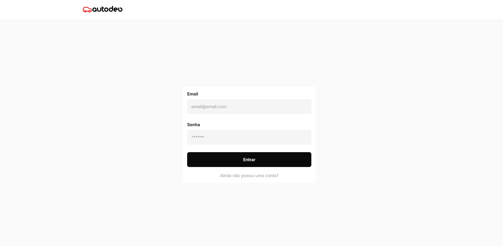
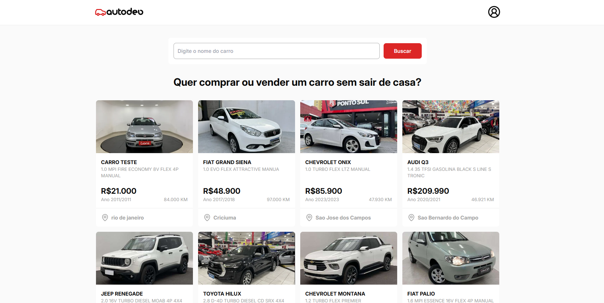
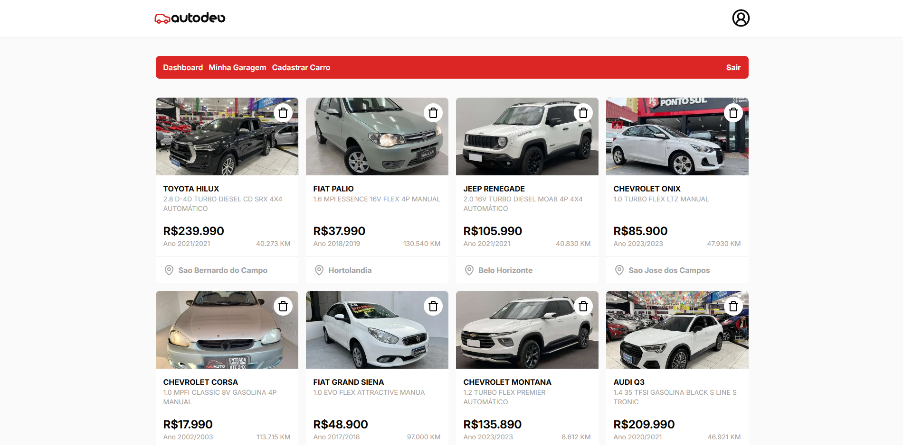
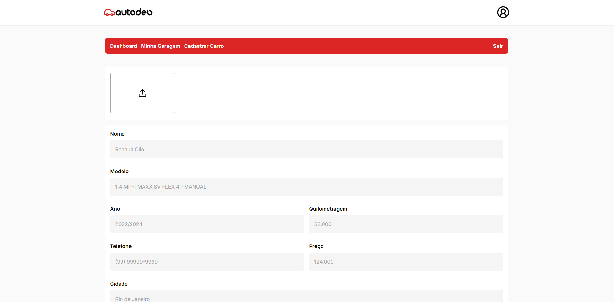

<h1 align="center" style="font-weight: bold;">Auto DEV 🚘</h1>

<p align="center">
 <a href="#tech">Tecnologias</a> • 
 <a href="#started">Primeiros Passos</a> • 
 
</p>

<p align="center">
    <b>Desenvolvimento de uma plataforma de compra e venda de carros</b>
</p>

<h2 id="layout">🎨 Layout</h2>

<p align="center">
    
    
    
    
   
</p>

<h2 id="technologies">💻 Tecnologias</h2>

- React
- Firebase
- TypeScript
- TailwindCSS

<h2 id="started">🚀 Primeiros passos</h2>

<h3>Pré-requisitos</h3>

- [Node.js](https://nodejs.org)
- [Git](https://git-scm.com/)

<h3>Clonando</h3>

```bash
git clone https://github.com/reisArthur2602/auto-dev
```

<h3>Configure as váriaveis .env </h2>

Use o`.env.example` como referência para criar seu arquivo de configuração `.env` com suas credenciais do Firebase

```yaml
VITE_FIREBASE_API_KEY=
VITE_FIREBASE_AUTH_DOMAIN=
VITE_FIREBASE_PROJECT_ID=
VITE_FIREBASE_STORAGE_BUCKET=
VITE_FIREBASE_MESSAGING_SENDER_ID=
VITE_FIREBASE_APP_ID=
```

<h3>Rodar o Projeto</h3>

```bash
cd nome-do-projeto
npm install
npm run dev
```

<h3>Design</h3>

[🖊️ Protótipo no Figma](https://www.figma.com/design/gsgiOTa6c5QtJxmB6y6h15/Auto-Dev?node-id=0-1&t=3aC9NrTct9rsCxOc-1)
