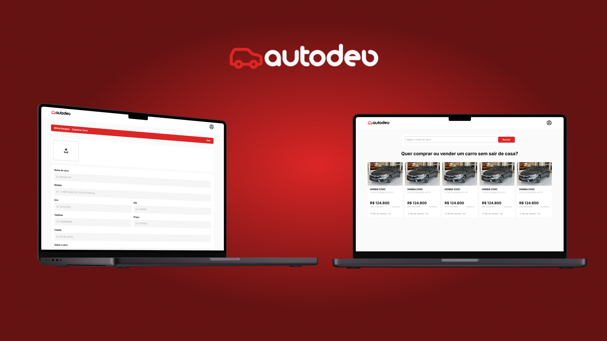

  

<h1 align="center">AutoDev</h1>

  <b>Plataforma de venda de carros</b> 
  Quer comprar ou vender um carro sem sair de casa?

## 🚀 Introdução

**_Bem-vindo ao AutoDev! O AutoDev é uma plataforma de venda de carros, que permite ao usuário comprar ou vender um carro de forma prática e rápida._**

 

## 🚀 Dependências

> Requisitos para rodar o projeto...

 

## `📖 Instalação`

 

> Como iniciar

1. Clone o repositório `git clone https://github.com/reisArthur2602/auto-dev`
2. Instale as dependências `npm install`
3. Rode o projeto `npm run dev`

 

## 🚀 Tecnologias

> Tecnologias utilizadas no projeto...

## 🚀 Design

> Design do projeto foi feito utilizando a ferramenta Figma.

<a href="https://www.figma.com/design/gsgiOTa6c5QtJxmB6y6h15/Auto-Dev?node-id=0-1&t=vi8g39qyLx7JYzHA-1"> Link do Protótipo no Figma<a/>

